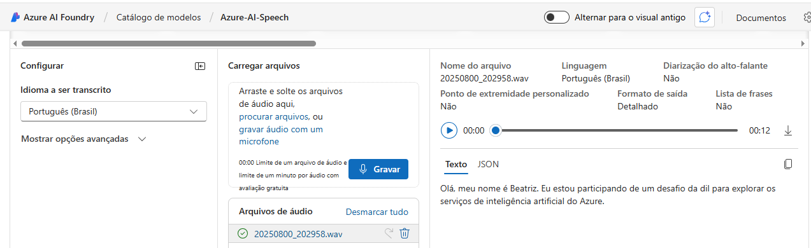

# projeto-azure-ai-speech-language-lab

# Azure AI – Speech Studio & Language Studio Lab

## 🎯 Objetivo do Desafio
Este repositório foi criado para documentar minha prática no uso do **Azure Speech Studio** e **Azure Language Studio**, explorando recursos de **IA de Voz** e **Processamento de Linguagem Natural (NLP)**.  

O projeto faz parte do desafio proposto pela [DIO](https://www.dio.me/).

---

## 🧠 Conceitos Explorados
### 🔹 Speech Studio
- Reconhecimento de fala (Speech to Text)
- Síntese de fala (Text to Speech)
- Customização de vozes

### 🔹 Language Studio
- Análise de sentimento
- Extração de frases-chave
- Detecção de idioma
- Respostas a perguntas (QnA)

---

## 🛠️ Ferramentas Utilizadas
- [Azure Speech Studio](https://speech.microsoft.com/)
- [GitHub](https://github.com/)

---

## 📌 Experimentos Realizados
### 🔹 Speech Studio
- Testei a conversão de **fala para texto**, com reconhecimento preciso mesmo em diferentes sotaques.  
- Modelei **voz sintética personalizada** para transformar texto em áudio natural.  

📷 Resultado do teste Speech to Text:

---
## 👤 Autor
- **Nome:** Beatriz Oliveira Borges  
- **GitHub:** [BeatrizOBorges](https://github.com/BeatrizOBorges)  
- **LinkedIn:** [Beatriz Borges](https://www.linkedin.com/in/beatriz-borges-24a776268/)

---
